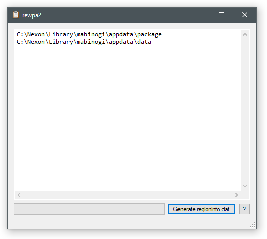

rewpa
=============================================================================

This rewpa is the second version of the region parser the Aura team used to
generate the regioninfo.dat that Aura servers use as the source for prop
and event information, such as their shape and type.

This new version has a more pleasing UI and supports multiple sources
for regions, so you can not only parse the client's pack files,
but also, for example, a data folder with modified region files.

The resulting regioninfo.dat can be used with any Aura server.

Usage
-----------------------------------------------------------------------------

1. Open rewpa
2. Enter folders to search for regions, for example:
   ```
   C:\Nexon\Library\mabinogi\appdata\package
   C:\Nexon\Library\mabinogi\appdata\data
   C:\Mabinogi\extracted_data\world\world.trn
   ```
3. Click Generate and wait until it's done.
4. Save regioninfo.dat.

Preview
-----------------------------------------------------------------------------



Links
-----------------------------------------------------------------------------

- GitHub: https://github.com/exectails/rewpa
